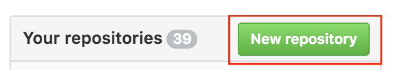
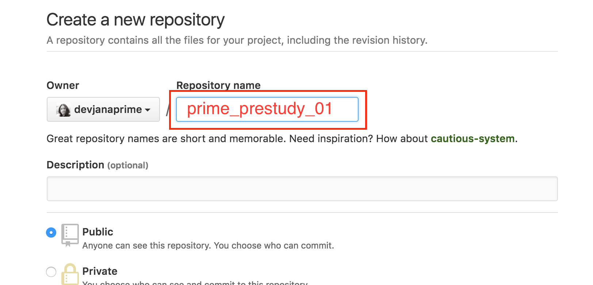
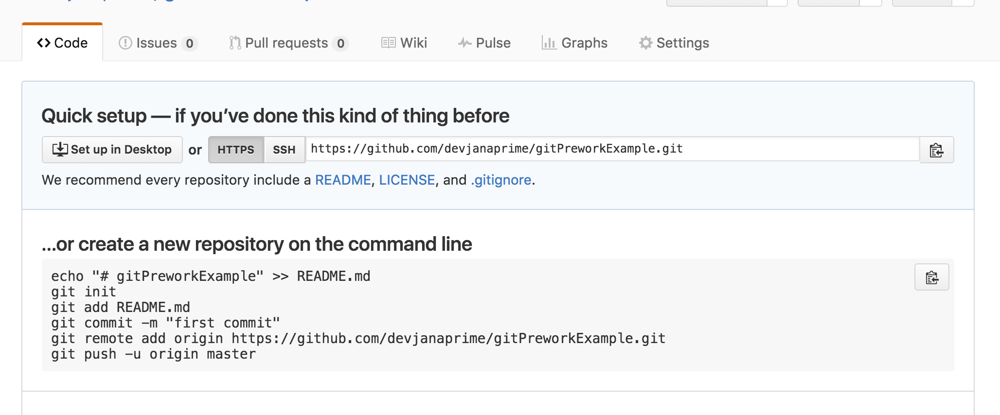
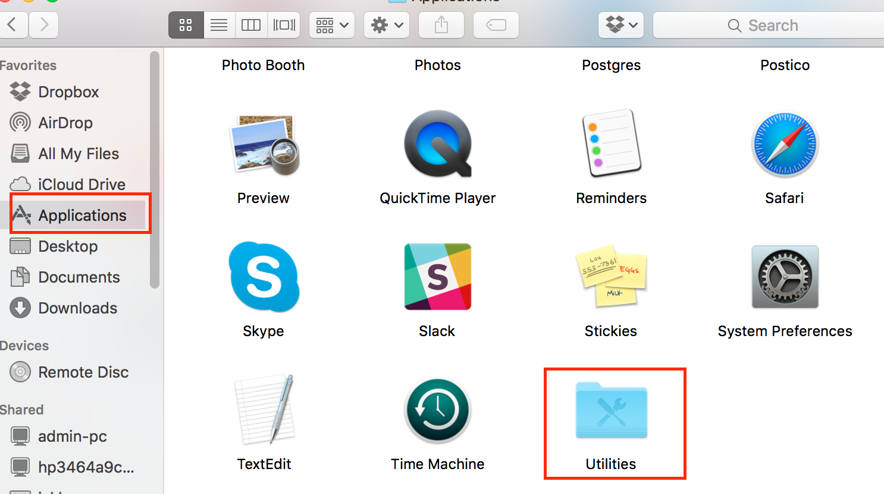
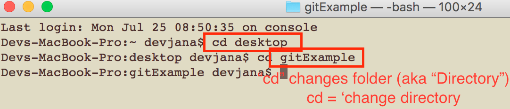
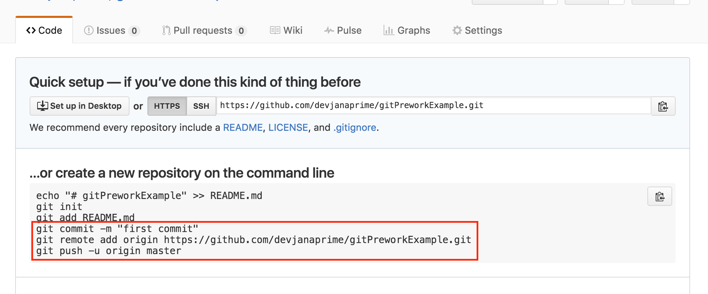
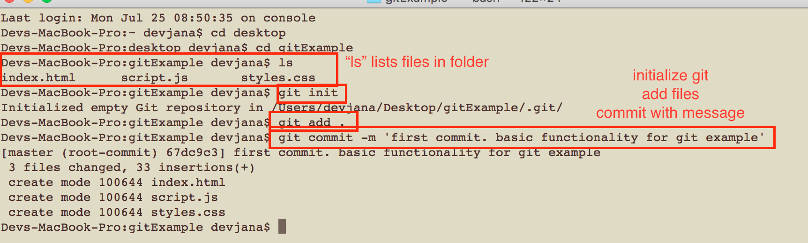
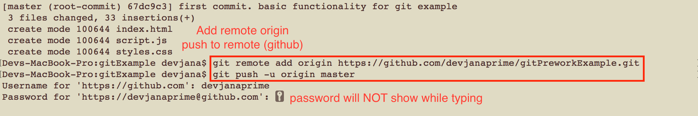
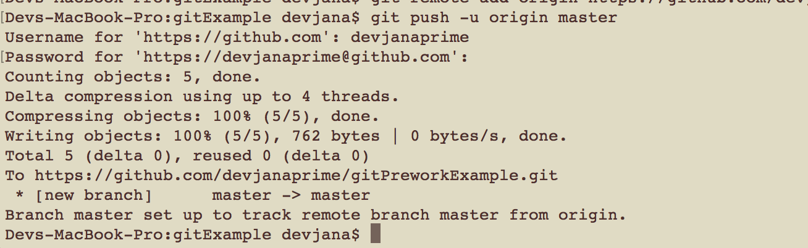
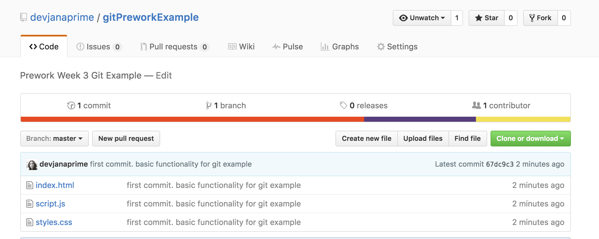

Week 3 Prework Git Example
====================
Git is a Version Control (VC) tool that can be pretty intimidating so we'll take a step by step approach. Git is a SUPER powerful tool that is (pretty much) ubiquitous in the industry so growing your understanding with it is important and requires time and practice. We will be using it throughout your time at Prime.

First, If you haven't installed Git: https://git-scm.com/downloads

Next, let's discuss the simple project for this week:  
* index.html
* javascript with a simple function
* css file

## I. Create file structure
Create the above first. Just something simple with the html, css, and js files. There should be a function in the js file that is run onLoad for the body and another that is triggered when the user clicks on an element on the page. Nothing too fancy needed. You can use the above as an example.

The next goal is to get you acquainted to using Git & the terminal. You can always update the content later.

## II. Create GitHub repo
Project in order? OK. Now log in to github and create a new repo:

Make sure to name it correctly:

You'll now see something like the following. This is fine for now as your shiny new repo is bereft of actual content - a situation we'll shortly seek to rectify.

Leave the repo URL tab open as we'll return to it later.

## III. Create a Git repo (via the terminal)
Next, let's open the Terminal. If you are new to Macs you'll find the Terminal in Application - Utilities:

Now we'll need to navigate to the project folder. I've put mine on the desktop in a folder named "gitExample". We'll use the `cd` command to move through the system. Usually you are at your user folder when you open terminal. From here, since my folder is on the desktop, I will use `cd desktop` to got to the desktop. Then I'll use `cd gitExample` to enter the project folder:

Your project is likely not in the same folder so take a few moments to get acqainted with this process and navigate to your project's folder. You can use the `ls` command to list the files/folders in the current folder at any time.
Once you've navigated to your project folder, we'll need to initialize git and set up our repo as the "remote". Let's look at the instructions github gave us when we created the new repo:

Before we can use Git at all, we'll need to initialize git in the project's folder. In the terminal type in and execute `git init`. You should receive a message showing that git has "Initialized empty git repository in," your project folder.

Let's use these commands in the folder of our project in the Terminal. This will "commit" the current state of the project.
This process is something to which you'll get used with practice, but the basic flow is as follows:
* Make changes
* add
* commit (local)
* push (remote)

At this point you've made changes (yes, creating the files counts as changes) and we're going to add the changes to the git project, then commit them.

In the example they only have the "README.md" file and if you look at the example they add just that one file. We're going to cheat a bit and use the following command `git add .` which adds all changed files.  
We'll also be using the `git commit -m` command followed by a commit message (thus the "-m").

Note that, in my example, I'm asked for my username and password. Depending on your setting you may not need to do this. Also, it is VERY important to note that, if asked for your password, it will NOT display while you are typing it.

Use the following commands:
`git add .`

`git commit -m 'my first commit'`:

At this point the changes are saved only locally. We're going to want to "push" them to our remote repo next. This will make them available from anywhere and eventually you'll be adding "collaborators" to your github projects for group work.

If all went well, you should see a message similar to the following which lets you know that the push was successful:

## IV. Check your work on GitHub
Refresh the guthub repo page and you'll see your work is now in the remote repo:

Note that files display the commit messages of their last change.

Now that you've successfully pushed your project to github you'll be able to access it from wherever. If you'd like to continue to make changes you can simply add/commit when changes are made then `git push origin master` and the github repo will be updated!

Git can be odd and intimidating, but the more you use it the more accessible it becomes. I recommend giving this another pass to make sure you are familiar with the steps. This is just scratching the surface of Git and Version Control in general. You'll want to keep this tool sharp as it will be one of the most used in your toolkit. Learn by doing and be patient.
